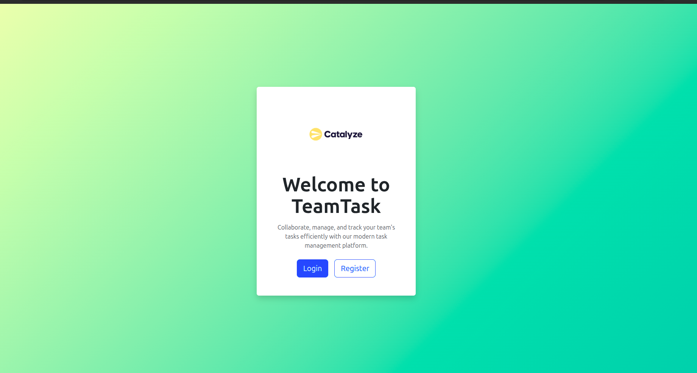
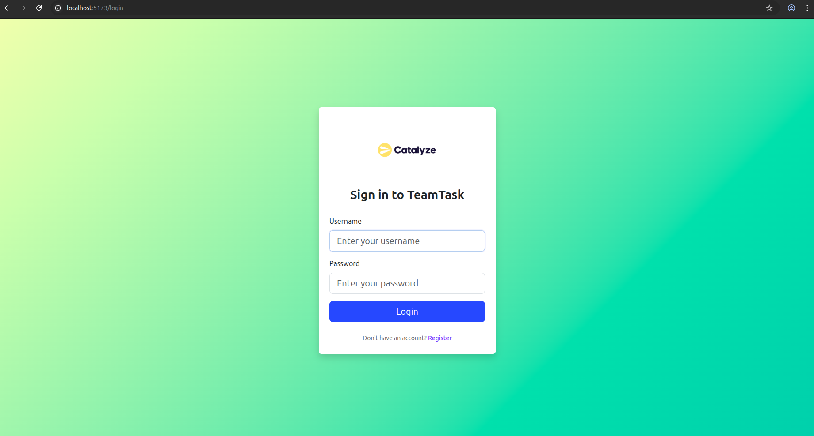
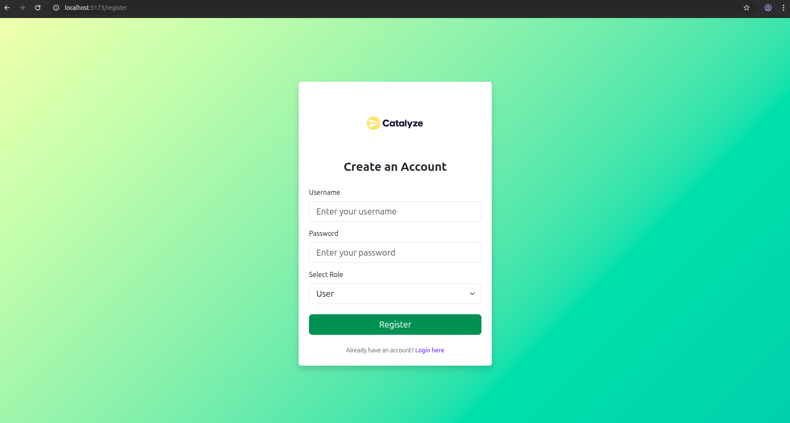
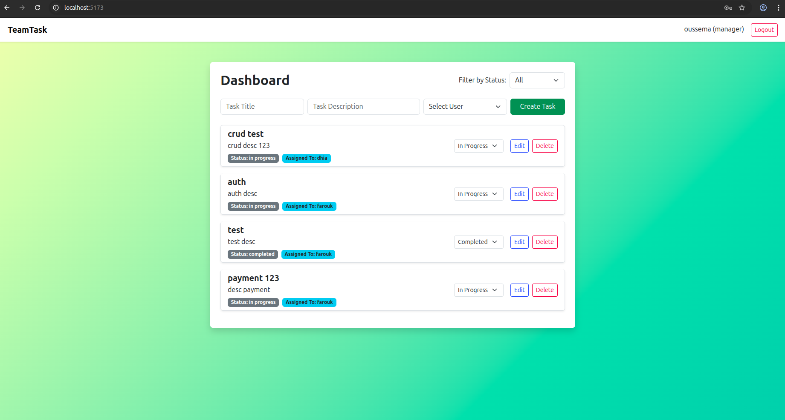
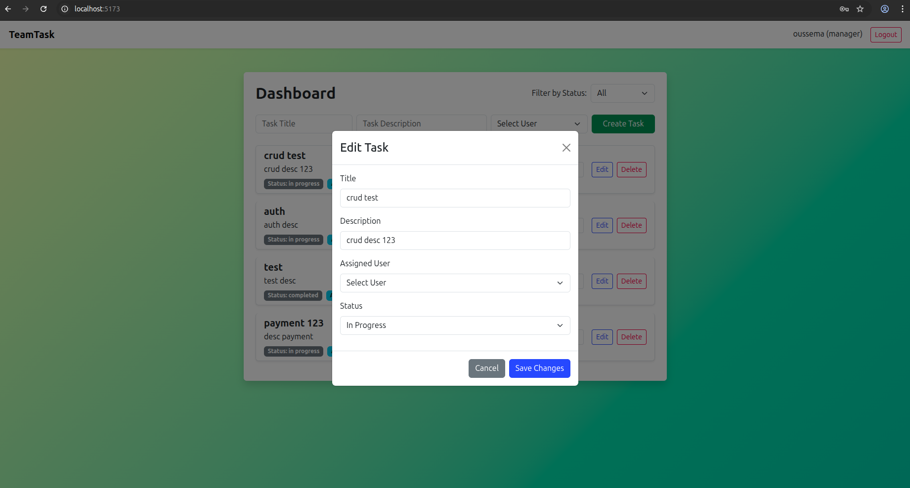
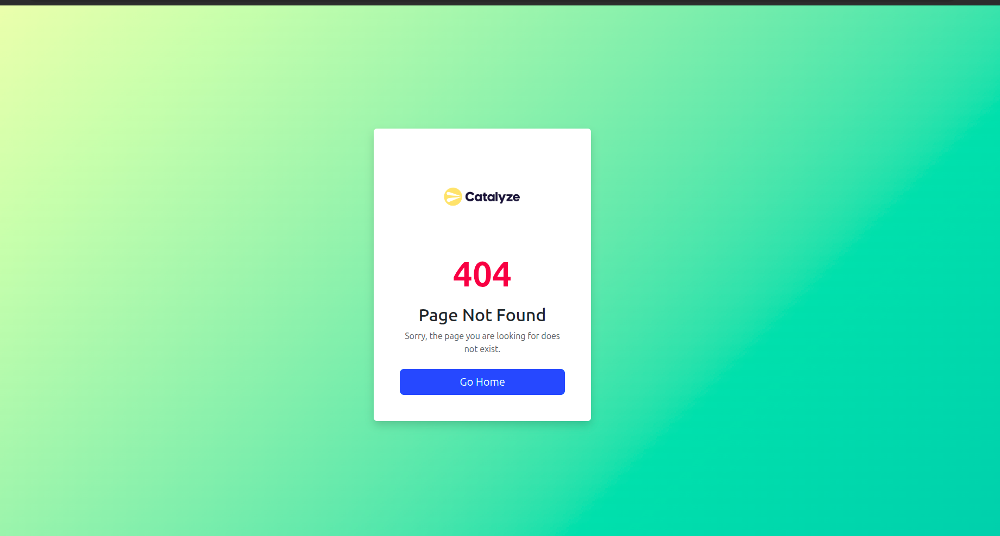

# TeamTask


<p align="center"><em>Landing page: Welcome and entry point for users</em></p>


<p align="center"><em>Login page: Secure user authentication</em></p>


<p align="center"><em>Register page: Create a new account as user or manager</em></p>


<p align="center"><em>Dashboard: View, manage, and track tasks</em></p>


<p align="center"><em>Edit Task: Managers can edit task details in a modal</em></p>


<p align="center"><em>Not Found: Custom 404 page for invalid routes</em></p>


TeamTask is a modern, full-stack task management application for teams. It features user authentication, role-based access (manager/user), task assignment, and a responsive, user-friendly interface.

## Features
- User registration and login
- Role-based access: manager and user
- Managers can create, assign, edit, and delete tasks
- Users can view and update their assigned tasks
- Beautiful UI with Bootstrap and custom gradients
- RESTful API with Express and MongoDB

## Project Structure
```
teamtask/
├── backend/         # Node.js/Express/MongoDB API
├── frontend/        # React + Bootstrap client
```

## Quick Start with Docker (Recommended)

1. **Clone the repository:**
   ```bash
   git clone <repository-url>
   cd teamtask
   ```

2. **One-command deployment:**
   ```bash
   ./deploy.sh
   ```
   This script will create `.env` from template, build, and start all services.

3. **Manual deployment:**
   ```bash
   # Create environment file
   cp .env.example .env
   # Edit .env with your preferred values (or use defaults)
   
   # Start the application
   docker compose up --build -d
   ```

4. **Access the application:**
   - Frontend: http://localhost
   - Backend API: http://localhost/api

### Development Setup

If you prefer to run services individually:

#### Backend
1. `cd backend`
2. `npm install`
3. Create a `.env` file with your MongoDB URI and JWT secret:
   ```
   MONGO_URI=your_mongodb_uri
   JWT_SECRET=your_jwt_secret
   ```
4. `npm start`

#### Frontend
1. `cd frontend`
2. `npm install`
3. `npm run dev`

## Production Deployment

The application is production-ready with:
- **Docker Compose**: Multi-service orchestration
- **Nginx**: Reverse proxy, static file serving, security headers
- **MongoDB**: Persistent data storage with authentication
- **Health checks**: Service monitoring and auto-restart
- **Rate limiting**: API protection against abuse
- **SSL ready**: Uncomment SSL sections in nginx config

### Production Commands
```bash
# Build and start all services
docker-compose up -d --build

# View logs
docker-compose logs -f

# Stop services
docker-compose down

# Stop and remove volumes (⚠️ deletes data)
docker-compose down -v
```

## Usage
- Visit http://localhost (Docker) or http://localhost:5173 (development)
- Register as a user or manager
- Managers can assign tasks to users
- Users can update the status of their tasks

## Architecture

- **Frontend**: React + Bootstrap + Vite (served by Nginx in production)
- **Backend**: Node.js + Express + JWT authentication
- **Database**: MongoDB with authentication
- **Reverse Proxy**: Nginx with security headers and rate limiting
- **Containerization**: Docker with multi-stage builds

## Environment Variables

See `.env.example` for all available configuration options:
- `MONGO_ROOT_USER`: MongoDB admin username
- `MONGO_ROOT_PASSWORD`: MongoDB admin password  
- `JWT_SECRET`: Secret key for JWT tokens
- Database and connection settings


